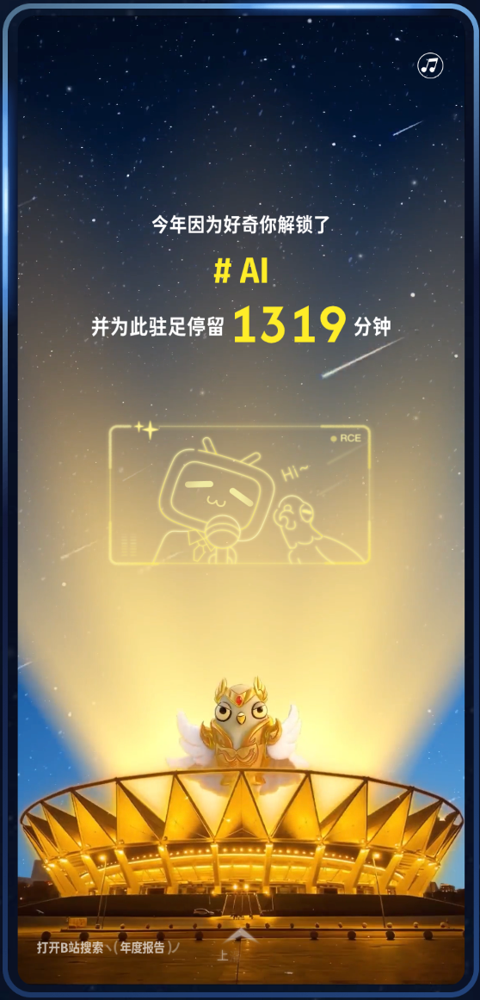
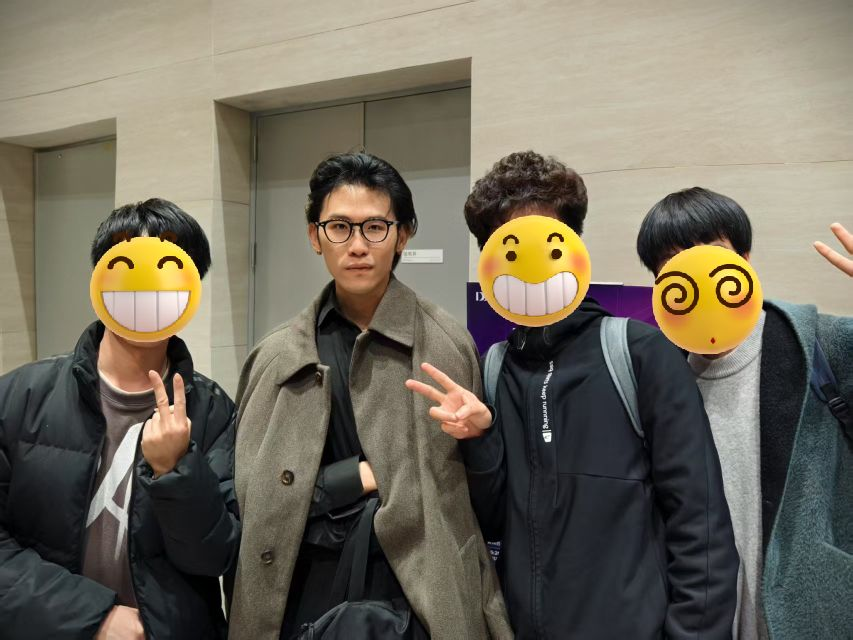

# 2025 年终总结

> 这是摘要

{/* truncate */}

## 碎碎念

### 工作

今年作为校招生，加上提前实习的时间也算是工作大半年了，很庆幸自己能加入一个理想中的团队，mentor 和 leader 都很棒，同事之间关系也很融洽。不过，上班之后感觉时间过得真快呀，每天两点一线的生活，不知不觉间就要入冬了，感觉上个月还在过夏天。

与之前实习相比，正式工作后工作强度确实高了不少。实习的时候，每天下班还会打打游戏、看看番，周末去机厅出个勤；现在下班后只想躺床上刷视频，周末也只想在家待着，而且感觉周末过得特别快。我的时间都去哪儿了🤔？不过，失去了个人时间，得到了工作上的一些成长。今年了解到了业务需求与技术需求的区别、了解了大型需求的完整开发流程、尝试主动推进进度、见证了组织架构调整等等。

在技术上，今年对我来说无疑是AI的元年，之前一直想了解这方面的内容，尝试过几次，都因找不到学习方式而放弃。非常感谢 leader 给了我参与 Agent 建设的机会，虽然只是用 LLM 调用 Workflow，但是对于了解 AI 应用却是一个很好的切入点。年初 Deepseek 发布时，我当时对模型还没有什么概念，只知道有一个很厉害的国产模型发布了，现在了解了各种模型的常见用途，了解了 Agent 与 AI NPC 所用到的一些技术，希望能跟上时代发展吧🙏🏻。

### 生活

今年最开心的事情就是拥有了自己的 OC (Original Character) ゆいじゅ，她的到来为互联网生活增添了不少乐趣，日常聊天被别人夸赞可爱时，就会特别开心。感谢@墨小斓 老师将她画得这么可爱，这也是我目前约到的最喜欢的一张图。今年约稿一共花了 7171，虽然有点贵，但是这都是军费，不能省😭。

在当下大模型与工程方案百花齐放的时代，想利用现有的技术为她创作点什么，之前想了很多点子，但很少付出行动，最近一个月在狠狠地造轮子，想为她打造一个AI小镇，在她在里面生活。周末大部分时间都花在上面的，但是进度好慢呀😭。写这个项目才算体会到从0到1搭建一个可维护的系统有多难，接口设计地不够通用，后续开发又要大量重构；如果一开始详细设计，需要考虑的东西又太多，容易陷入泥潭，啥也想不明白，从而影响开发进度。希望明年能赶快把这个项目跑起来🙏🏻。

今年还做了一件突破性的事就是一个人去日本进行了为期十一天的自由行，这是我第一次出国旅行，第一次去到一个非母语的国家。第一次出国之前还是蛮紧张的，担心语言不通、担心手机丢了怎么办、担心会不会做不懂电车...出国前做了很多攻略，也确实起到了作用。有了第一次的尝试，后面又去了几次，今年一共去了四次日本，去过的地方包含关西、关东、北陆、四国、香川县，要不是最近的中日关系比较紧张，我现在可能在北海道吧，可恶的右翼分子😭。

## 回忆录

- 一月第一次去日本进行了一次十一天的自由行，见到了之前只能在博主视频中观看的风景。

- 2月5日刚过完年没多久，当时的天气还很冷，前往杭州去提前实习，正式开启了社畜的生活，有一种背井离乡去外打拼的感觉。这个月就开始了ゆいじゅ的人物设计，并约了一张摸鱼图看看效果，没想到这么早就开始了。

- 三月参加了阿里的D2大会，见到了许多大佬，并成功与黄玄和“飞书之父”whgg合影。

- 四月与朋友一起去日本看了樱花🌸，可惜没看到樱吹雪。第一眼看到大片的樱花树真的有种梦幻的感觉，而且感觉樱花自带滤镜。四月底ゆいじゅ的设计正式确定，真的好可爱。

- 五月配了台主机，第一次装机花了一个通宵的时间，现在依旧记得屏幕点亮的那一刻，外面的天都亮了。其余时间应该在准备毕设，没什么记忆。

- 六月去高松进行了一次跳岛之旅，怀念在小岛上环岛骑行的日子，舒适的海风配上湛蓝的大海，真的很放松。六月底从学校顺利毕业成为了一个真正的牛马。

- 七八九月份没什么特殊的记忆，去参加了 Poppin'Party 的十周年演出，第一次参加这种大型的 live。九月换了工区，也跟着搬到杭州西边，被发配边疆。

- 十月又去了日本，去中部小城市体现日本乡下的生活。

- 后面也没什么特殊的活动了，感觉毕业后完全变成社畜，没有以前那么有活力，时间也开始加速。

## 感想

### AI Coding

今年是我真正开始深度使用 AI Coding 产品的一年，对“AI是否会取代程序员”有了一些看法。首先 AI Coding 确实能提效，既然能提效，那么量化的指标就是要减少一部分对程序员的需求。但是，应该不会完全取代程序员，因为语言有时候是无力的，你无法清晰的向模型表达你的想法，而且模型的理解与你的理解可能还不一致。每次有新模型发布，网上就会有一些展示 Coding 效果的视频，一句话就能构建一个完整的应用，但这些都是一些 demo，它们的需求是模糊的，如果让模型在现有的系统修改某些功能，效果可能不太理想，我们需要的是一个可维护的系统，而不是一些惊艳的 demo。感觉目前让 AI 在现有的系统里自行写出可维护的代码还有点难，针对一个系统有太多的规范需要建设。

### 日本

目前旅游下来的感受，日本确实是一个风景很棒的国家，服务业很发达，文化也比较多元，许多建筑有着历史的陈旧感。与国内相比，感觉日本的生活节奏没有那么快，可能是因为生活方面的基础建设没有国内这么发达，时间没有被极致地压缩。与大城市的繁华相比，日本的许多小城市感觉死气沉沉的，许多店铺天黑就关门，6点之后核心商业区基本都看不到人了。城市规划有一定的规律，一个以地方名称命名的车站，周围是一些商业区，这里基本就是整个城市的核心区域，也是除了景区唯一能看到人的地方。

在去日本之前还想过，以后如果有机会，想逃离国内这疯狂内卷的环境，移居日本。去过一次之后就完全没有这种想法了，在国内生活习惯之后可能难以适应日本的节奏，感觉没有国内生活方便。而且，感觉那里没有什么想象力，到处十几年前的风景与建筑，生活会有点压抑，没有欣欣向荣的氛围。不过，日本作为旅游的地方，还是很好玩的。

## 展望

感觉 2025 年做的事情还挺多的，不过还是有许多想法没有实践，一方面是受限于时间与精力，另一方面是单纯的懒。26年继续加油，列一列26年的目标：

- 赶紧完善 AI 小镇的基础建设，跑通整体流程。

- 微调一个ゆいじゅ的对话模型

- 使用LLM为ゆいじゅ创作一些图

- 使用LLM为ゆいじゅ写一篇短篇小说

- 尝试直播

- 养一只小猫
