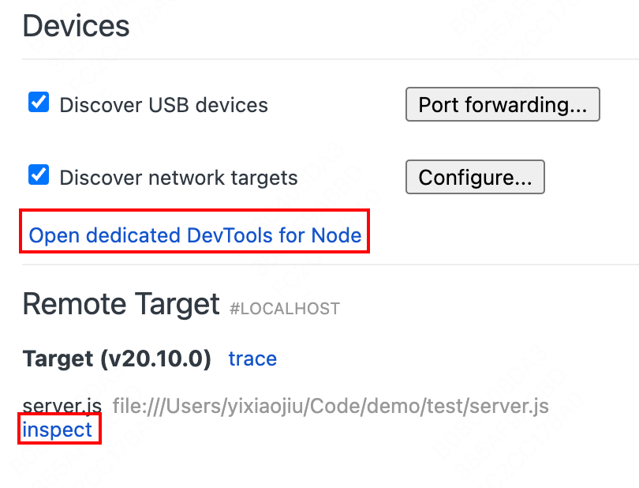
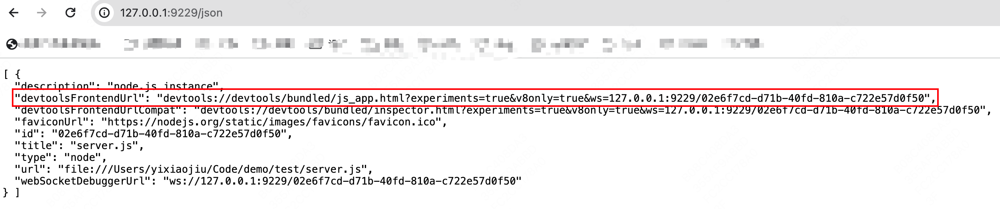
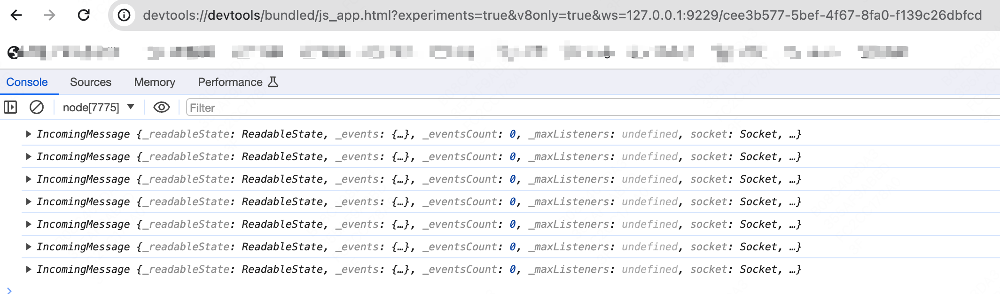
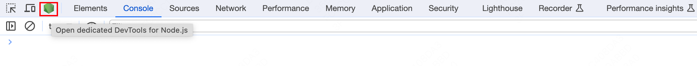
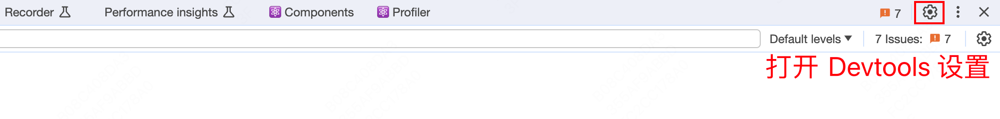
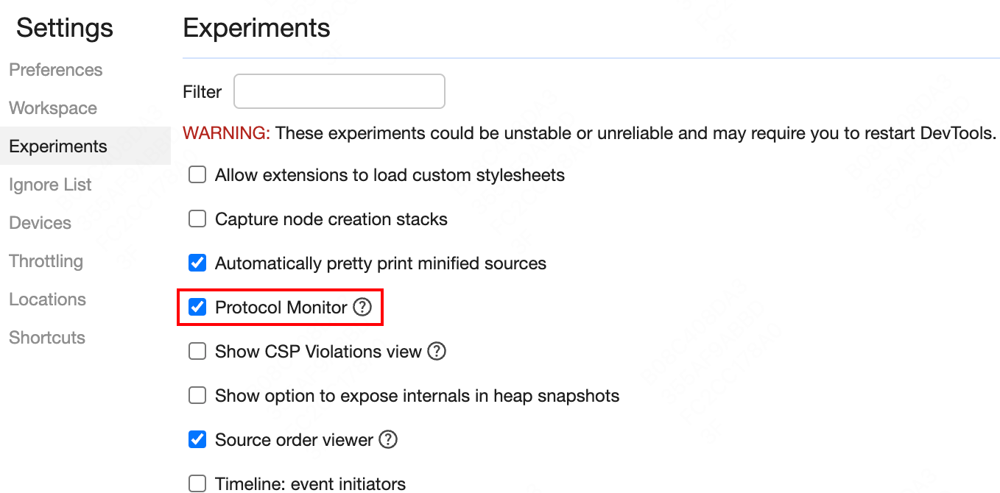
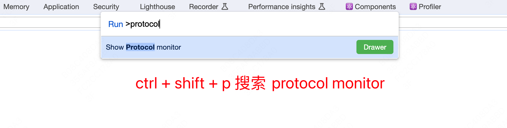

# 使用 Chrome Devtools 调试 Node 程序

在 Node 程序中使用 `console.log` 打印嵌套较深的对象时，无法完全展示该对象，而且终端的可读性较差，因此可以利用 Chrome DevTools 调试 Node 程序。

<!--truncate-->

## Quick Start

想利用 Chrome DevTools 调试 Node 程序，对 Node 程序有一个要求就是，Node 程序比较阻塞，比如监听一个 `Socket`，下文会解释原因。

首先创建一个示例文件 `server.js`

```js
// server.js
const http = require('http')

http
  .createServer((request, response) => {
    const { headers, method, url } = request
    console.log(request)
    let body = []
    request
      .on('error', (err) => {
        console.error(err)
      })
      .on('data', (chunk) => {
        body.push(chunk)
      })
      .on('end', () => {
        body = Buffer.concat(body).toString()
        response.on('error', (err) => {
          console.error(err)
        })
        response.statusCode = 200
        response.setHeader('Content-Type', 'application/json')
        const responseBody = { headers, method, url, body }
        response.write(JSON.stringify(responseBody))
        response.end()
      })
  })
  .listen(8080)
```

用 node 执行代码，并添加 `--inspect`

```sh
node --inspect server.js
```

---

然后使用以下任意一种方法打开 Devtools for Node.js：

1. 在 chrome 地址栏中打开 `chrome://inspect/#devices`。启动 node inspect 的时候，chrome 会自动捕获可调试的目标



2. 访问 `http://127.0.0.1:9229/json` 获取 `devtoolsFrontendUrl`，然后新建 tab 页面打开。Devtools 其实就是一个前端项目([仓库地址](https://github.com/ChromeDevTools/devtools-frontend))





3. 任意打开一个 Devtools，点击左边 Node 图标



此时，你不仅可以用 `Console` 进行调试，还可以用 `Sources` 面板进行断点调试

## 调试原理

在使用 Chrome DevTools 调试 Node 程序时，Chrome DevTools 是调试前端，Node 是调试后端，前后端使用 WebSocket 进行通信，使用 CDP([Chrome DevTools Protocol](https://chromedevtools.github.io/devtools-protocol/)) 协议约定数据的内容。在我们展开 `Console` 面板中的对象时，Node 会向 V8 查询对象的信息，然后展示，这也是为什么 Node 程序需要阻塞的原因。

我们可以打开 `Protocol monitor` 面板查看通信中的信息。`Protocol monitor` 是一项实验性功能，需要先启用。







然后对 `Console` 面板中的对象进行展开查看。


以上只是最基本的介绍，具体的调试原理可以查看：

- [深入理解 Chrome DevTools](https://zhaomenghuan.js.org/blog/chrome-devtools.html)
- [Chrome DevTools Frontend 运行原理浅析](https://zhaomenghuan.js.org/blog/chrome-devtools-frontend-analysis-of-principle.html)
- [Node Inspector 解析](https://theanarkh.github.io/understand-nodejs/chapter24-Inspector)
- [一文搞懂前端各种调试方法的原理](https://mp.weixin.qq.com/s/QHE32rzlZHqp1yWMfxaC9A)
- [Node Inspector](https://nodejs.org/docs/latest/api/inspector.html)
- [V8 Inspector](https://v8.dev/docs/inspector)

## 常见开发场景的调试方法

### 监听文件变动重启服务

现在 Node 实验性支持 watch 功能，[官方文档](https://nodejs.org/docs/latest/api/cli.html#--watch)

```sh
node --watch server.js
```

使用方法3打开 Devtools for Node.js

### Typescript

使用 [tsx](https://github.com/privatenumber/tsx) 包。

tsx 是对 node 的封装，支持所有 node 的命令行参数。tsx 会先用 esbuild 编译 ts，然后再交给 node 执行，并支持 watch 功能。缺点就是重启的时候，Devtools 捕获有点慢。

```sh
npm i tsx -g

tsx --inspect server.ts
```

### 调试 Cli 程序

可以修改 node_modules/.bin 下对应的 cli 程序，例如修改 vite 的可执行文件。

思路是给 node 添加 `--inspect` 参数，不同操作系统可能不一样，拿 MacOS 举例，将 `node_modules/.bin/vite` 文件内容修改为（记得将源文件备份）：

```sh
#!/bin/sh
basedir=$(dirname "$(echo "$0" | sed -e 's,\\,/,g')")
exec node --inspect  "$basedir/../vite/bin/vite.js" "$@"
```

然后正常运行 `npm run dev`，使用方法3打开 Devtools for Node.js。

## 调试 Deno 程序

[deno --inspect-wait](https://docs.deno.com/runtime/fundamentals/debugging/#--inspect-wait) 可以等待 inspect 连接后再执行代码，程序不需要阻塞
