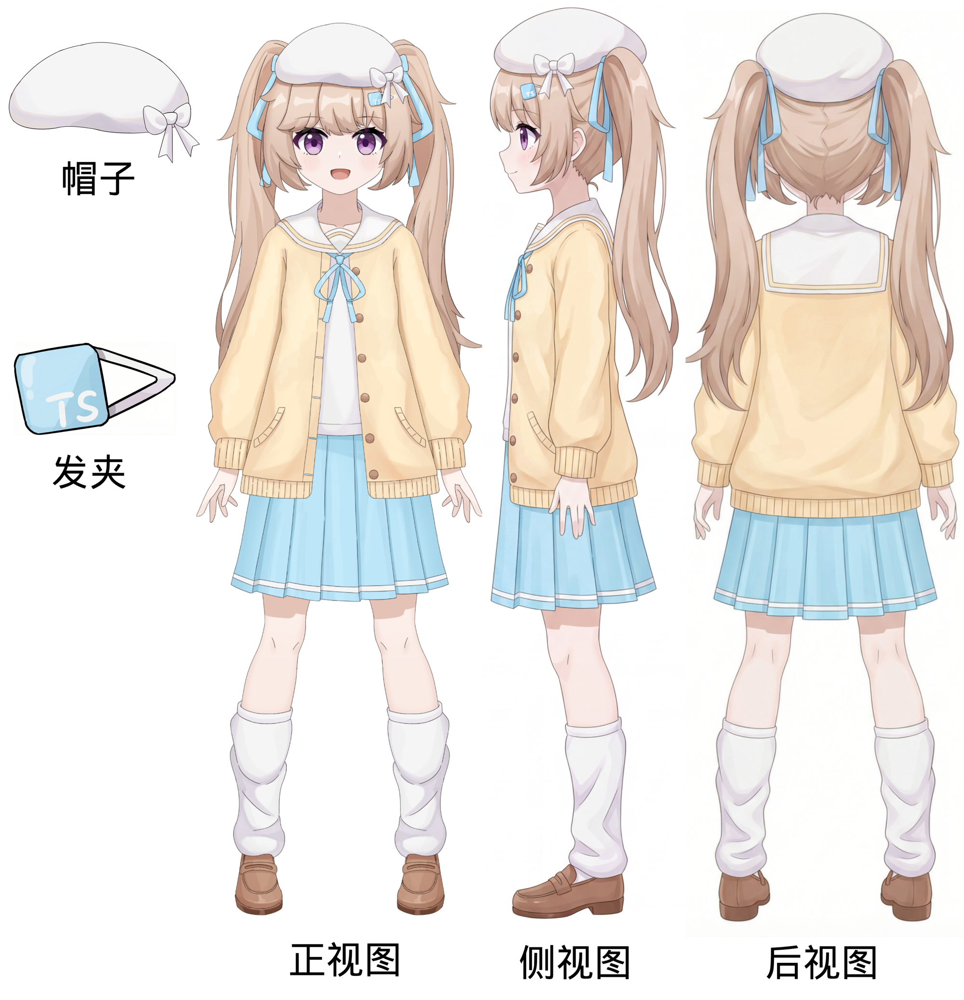

# Seedance2 日式动画经验分享

## 视频生成经验

日式动画，帧与帧之间的连贯性没有3D这么强，所以要给 Seedance2 一个参考，否则生成的视频帧率太流畅了，没有2D动画的感觉。

1. 可以上传一段参考视频（找一段动画视频）
2. 指定知名动画公司的名称，或者知名动画的作品名。例如：参考京都动画风格（强调高质量的作画和摄影后期效果 Kyoto Animation style）、参考《境界の彼方》动画风格。

Seedance2 对夜晚、高速镜头切换的视频，理解力不强，选择参考视频的时候需要注意。

Seedance2 的人物一致性很强，但是对于模型没见过的角色，仅靠一张角色立绘难以保证复杂场景下的人物一致性，所以最好有人设图作为参考。



Seedance2 会自己设计分镜，不要过度描写分镜，效果反而会变差，只需描述大致剧情。

Seedance2 需要多次抽卡，可以找一张场景参考图，避免多次抽卡场景不一致。

## 提示词示例

```
参考京都动画风格（强调高质量的作画和摄影后期效果 Kyoto Animation style），生成一段高质量2D打斗动画，突出打斗的视觉体验。
@人设图 角色手持武士刀，表情高冷，与@对战角色 夜间在神社前中激烈打斗，有多次刀剑碰撞。
[场景] 参考@场景图
[人物] 严格按照人设图@人设图 ，发夹参考@发夹。
[要求]角色不要发出声音，不要说话，角色不要起跳，角色动作流畅帅气。
```
