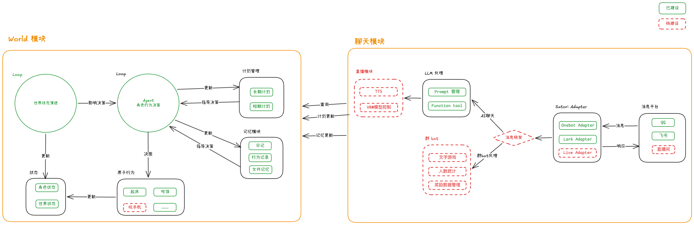
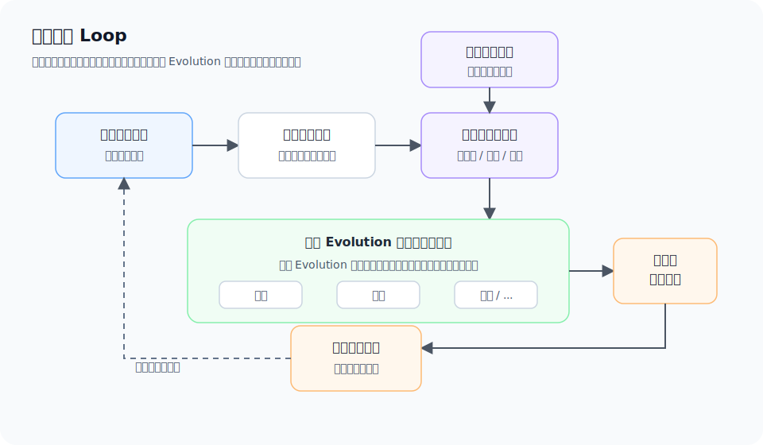
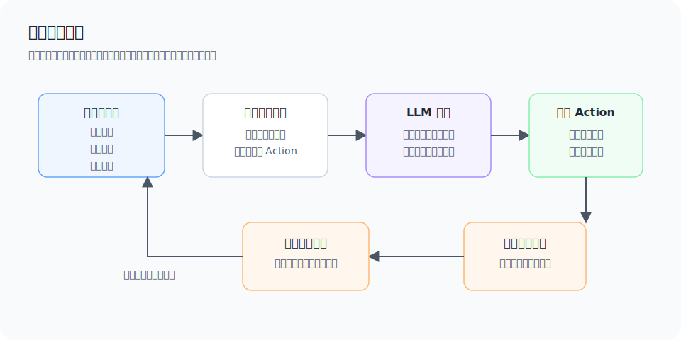
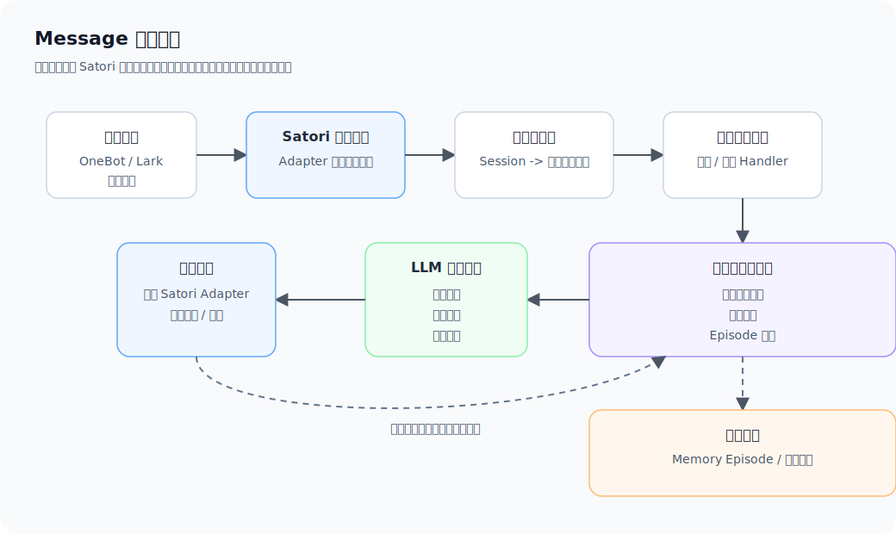
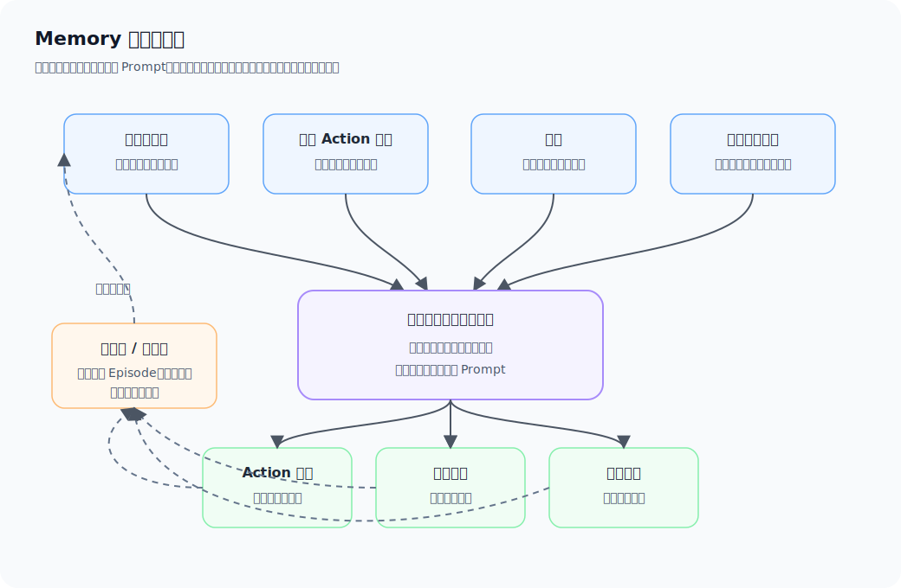

# Yuiju 技术实现介绍

> 这是一个融合了AI聊天与AI陪伴的项目，介绍了相关的技术实现

<!--truncate-->

## 项目简介

Yuiju 是一个 LLM 驱动的角色自主生活模拟项目。

它的核心目标不是做一个更会聊天的 AI 助手，而是让角色在一个持续运行的世界里生活。角色会根据自身状态、当前环境和历史经历做决策，执行行为，并留下可追溯的生活轨迹。

聊天只是这个系统的外部入口之一。用户看到的回复，应该尽量来自角色已经发生过的状态、行为、记忆和日记，而不是每次收到消息时临时编一段设定。

## 整体架构



项目使用 pnpm monorepo 管理。

- `@yuiju/world` 负责角色在世界里如何行动。
- `@yuiju/message` 负责用户如何和角色对话。
- `@yuiju/web` 负责观察世界运行状态。
- `@yuiju/utils` 提供跨模块复用的基础能力。
- `@yuiju/source` 存放角色相关素材和数据。

## World：世界模拟引擎

`@yuiju/world` 是项目的核心模块，负责推进角色生活。

它不是单纯的“聊天回复生成器”，而是维护两条持续运行的流程：一条推进世界状态，一条推进角色行为。

### 两条核心流程

`@yuiju/world` 同时维护两条持续运行的流程：世界状态推进和角色行为推进。

世界状态推进处理环境事实，角色行为推进处理角色行动。两者共享世界状态：角色会根据世界环境做决策，角色行为也可能反过来影响世界。

### 世界状态推进



世界状态推进负责维护“世界本身发生了什么”，例如时间、天气、场景开放状态和资源数量。

它像游戏引擎一样按固定间隔执行。每一轮都会读取当前世界状态，结合本轮外部命令，交给可配置的 Evolution 列表计算下一份世界状态，再写回存储。

这条流程不依赖用户消息，也不依赖角色当前是否正在执行 Action。

### 角色行为推进



角色行为推进负责维护“角色本人正在做什么”。它会读取角色状态、世界状态和历史经历，先计算当前可执行 Action，再让 LLM 在候选 Action 中选择。

LLM 只负责决策，不直接修改状态。真正的状态变化由 Action 执行逻辑完成，并沉淀为行为记录，供后续记忆、日记和消息回复使用。

Action 选择 Agent 返回的是一份结构化决策结果，用来说明“这轮选择哪个 Action，以及为什么选择它”：

```json
{
  // 本轮选择的 Action，只能来自当前可执行候选列表。
  "action": "从家去学校",
  // 选择这个 Action 的原因，会进入行为记录，也会影响后续上下文。
  "reason": "今天是工作日早上，悠酱在家，应该出门去学校上课。",
  // 少数 Action 可以由 Agent 给出动态耗时；没有动态耗时时可以省略。
  "durationMinute": 20,
  // 当本次行动影响长期或短期计划时返回；没有计划变化时可以省略。
  "planChanges": [
    {
      "type": "complete_short_term_plan",
      "title": "早上按时到学校"
    }
  ],
  // 当本次行动值得主动分享时返回。
  // 后续链路会再走一次 LLM，结合 Action 结果、角色状态、世界状态和群聊上下文，判断是否适合主动分享，并生成一条发到群聊里的生活消息。
  "proactiveShareIntent": {
    "shouldShare": true,
    "reason": "今天出门上学，可以顺手和用户说一下早上的状态。"
  }
}
```

这份结果本身不会直接改变角色状态。它会被交给后续 Action 执行流程，由具体 Action 决定状态如何变化、行为要持续多久、结束后留下什么记录。

### Action

Action 是角色行为的最小执行单元。

之所以要把角色行动拆成一个个原子 Action，是因为“生活”本身太连续了，不能直接丢给 LLM 自由发挥。系统需要先把复杂行动拆成可判断、可执行、可记录的步骤，再让模型在这些步骤里做选择。

这样设计有几个好处：

- 行为能被程序化执行，每个 Action 都有明确的状态变化和耗时。
- 行为能被规则过滤，角色不会选择当前状态下不该发生的事情。
- 行为能被记录下来，后续可以进入记忆、日记和消息上下文。
- 行为可以逐步扩展，新增生活能力时只需要补新的 Action。

一个 Action 配置大致长这样：

```ts
{
  action: ActionId.Go_To_School_From_Home,
  // 展示给 LLM 的候选行为说明，包含行为结果和耗时信息。
  description: "从家前往学校。[体力-7][饱腹-5][耗时20分钟]",
  // 前置条件决定这个 Action 当前是否能进入候选列表。
  precondition(context) {
    return isAtHome(context) && isWeekday(context) && isMorning(context);
  },
  // executor 负责真正执行行为副作用，状态变化必须在这里完成。
  async executor(context) {
    await context.characterState.setLocation(School);
    await context.characterState.changeStamina(-7);
    await context.characterState.changeSatiety(-5);
  },
  // 行为耗时会影响下一轮角色行为推进的时间点。
  durationMin: 20,
}
```

LLM 只在通过前置条件的候选 Action 中选择，不直接修改角色状态。

## Message：外部消息系统



`@yuiju/message` 是外部消息入口，负责把不同平台的消息接入同一套对话链路。

### 统一消息网关

消息系统使用 Satori 作为统一消息网关。OneBot、Lark 等平台通过 adapter 接入后，业务层只需要处理统一的消息事件，不需要为每个平台单独写一套对话流程。

项目里也维护了 OneBot 的 Satori adapter。后续如果接入新的平台，优先扩展 adapter，而不是改动核心消息处理链路。

### 消息标准化

平台消息进入系统后，不会直接交给 LLM。系统会先把 Satori Session 转成统一的消息结构，保留平台、会话、发送者、时间和消息内容。

文本、图片、引用、@、表情等内容会被投影成统一的历史片段。这样后续构建 Prompt 时，群聊和私聊可以复用同一套上下文格式。

### 会话上下文管理

群聊和私聊分别维护自己的会话上下文。每条用户消息和机器人回复都会写回对应会话，保证下一轮回复能看到真实对话历史。

群聊里如果同一个群连续收到新消息，旧的回复生成会被取消，避免过期回复在更晚的时候发出去。

### 上下文压缩与记忆沉淀

消息上下文不会无限拼接历史。系统会同时维护最近**原始消息、滚动摘要和自然对话窗口**。

最近原始消息用于保留短期上下文；滚动摘要负责把较早的对话压缩成 summary；自然对话窗口会在合适的边界沉淀成 Memory Episode，并更新人物记忆。

## Memory：记忆模块

> 记忆是 AI 陪伴非常重要的一个模块，它是一个角色的灵魂所在。



模块的记忆模块还有很多需要优化的地方，但整体已经基本可用。

其中的「用户记忆文件」是用 json 文件存储的，而且让 LLM 自更新，偶尔会出现记忆更新错误的情况。

## 数据与基础设施

项目配置统一来自根目录 `yuiju.config.ts`。

核心基础设施包括：

- Redis：保存角色和世界实时状态。
- MongoDB：保存行为历史、消息记录、记忆和日记。
- LLM Provider：用于行为决策、消息回复、日记生成等模型能力。
- pnpm monorepo：管理多个业务包和公共包。
