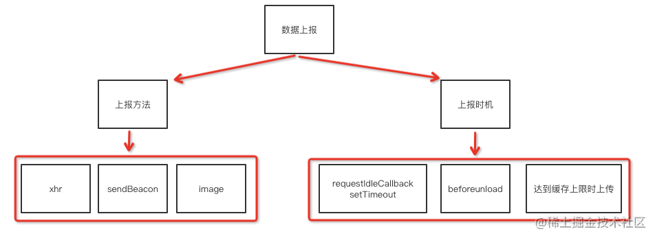

# 前端工程化

> 整理 [带你入门前端工程](https://woai3c.github.io/introduction-to-front-end-engineering/#%E7%AE%80%E4%BB%8B)

## 技术选型

- 可控性：如果这门技术因为 BUG 对项目造成了影响，团队中有人能够解决它
- 稳定性：一门技术更新迭代比较稳定，不会有特别大的修改，比较靠谱。即使有，也很容易做到向后兼容（迁移简单、成本小）。
- 适用性：是指需要根据业务场景和团队成员来选择技术。
- 易用性：容易理解、易上手

该如何做技术选型？

1. 必须可控。
2. 核心项目必须使用成熟稳定、可靠的技术栈，边缘小项目可以使用新技术给团队成员练手或者踩坑。
3. 在第 2 点的基础上，再按适用性做选择。
4. 在第 3 点的基础上，再按易用性做选择。

## 统一规范

- 代码规范：[ESLint 与 Prettier 结合最佳实践](https://github.com/ChelesteWang/eslint-vs-prettier)
- Git：husky 与 lint-staged
- 项目规范：项目文件的组织方式和命名方式

## 前端组件化

- 高内聚，低耦合
  - 高内聚，就是指一个函数尽量只做一件事
  - 低耦合，就是两个模块之间的关联程度低。
- 模块化、组件化
  - 模块化，就是把一个个文件看成一个模块，它们之间作用域相互隔离，互不干扰
  - 组件化，页面里的 UI 组件

## 测试

- 单元测试
- E2E测试

## 构建工具

### webpack

- 自定义模块系统：每一个文件都是一个模块，无论你开发使用的是 CommonJS 规范还是 ES6 模块规范，打包后的文件都统一使用 webpack 自定义的模块规范来管理、加载模块。

[深入了解 webpack 模块加载原理](https://juejin.cn/post/6872354325553741838)
[Webpack 原理系列](https://juejin.cn/column/6978684601921175583)

### rollup

- 利用ESM 模块，静态分析代码中的 import，并将排除任何未实际使用的代码。
- 支持程序流分析，能更加正确的判断项目本身的代码是否有副作用（配合 tree-shaking）

[从 rollup 初版源码学习打包原理](https://juejin.cn/post/6898865993289105415)

rollup 不看你引入了什么函数，而是看你调用了什么函数，如果你手动在模块顶部引入函数，但又没调用。rollup 是不会引入的

## 自动化部署

- Gitea + Jenkins：Gitea 用于构建 Git 局域网服务器，Jenkins 是 CI/CD 工具，用于部署前端项目。
- Github Actions

### 部署方式

- 蓝绿部署：在部署过程中同时运行两个版本的程序。部署新版本时，不停掉旧版本的服务器，然后等新版本运行起来后，再将流量切换到新版本。缺点是在部署过程中，需要配置双倍的服务器。
- 滚动发布：在升级过程中，逐台逐台的替换旧版本服务器。先启动一台新版本的服务器，再停掉一台旧版本的服务器。这样在部署过程中只需要 N + 1 台的服务器。
- 灰度发布：灰度发布在新开启一台服务器后，先不将流量切换过来。而是先由测试人员对其进行测试，如果运行没问题，再将流量切换过来。同时在运行期间收集各种数据，如果此时将新旧版本的数据进行对比，就是所谓的 A/B 测试。当发现新版本运行良好后，再将剩下的服务器用同样的过程逐步替换。最后完全关掉旧版本的服务器，完成灰度发布。如果在发布过程中发现新版本有问题，就可以将流量切回到旧版本服务器，这样将负面影响控制到最小。

## 前端监控

### 什么时候需要监控

- 当你的应用频繁报错找不到原因的时候。
- 需要分析用户兴趣爱好、购买习惯。
- 需要优化程序的时候，可以做监控收集数据，做针对性的优化。
- 需要保证服务可靠性稳定性。

监控的作用有两个：事前预警和事后分析

- **事前预警**：提前设置一个阈值，当监控的数据达到阈值时，通过短信或者邮件通知管理员。
- **事后分析**：通过监控日志文件，分析故障原因和故障发生点。从而做出修改，防止这种情况再次发生。



### 错误数据采集

- 资源加载错误，捕获资源加载失败错误 js css img...

```js
window.addEventListener('error', (e) => {})
```

- js 错误

```js
window.onerror = (msg, url, line, column, error) => {}
```

- promise 错误，捕获到未处理的 promise 错误

```js
window.addEventListener('unhandledrejection', (e) => {})
```

- sourcemap

[source-map](https://github.com/mozilla/source-map)

这时 js 文件放在静态服务器上供用户访问，map 文件存储在服务器，用于还原错误信息。source-map 库可以根据压缩过的代码报错信息还原出未压缩前的代码报错信息。

### 行为数据采集

- PV、UV

PV(page view) 是页面浏览量，UV(Unique visitor)用户访问量。PV 只要访问一次页面就算一次，UV 同一天内多次访问只算一次。

- 页面停留时长
- 页面访问深度
- 用户点击
- 页面跳转

### 数据上报

- sendBeacon
- XMLHttpRequest
- image

## 性能优化

## 重构

## 微服务

将一个大型、复杂的应用分解成几个服务，每个服务就像是一个组件，组合起来一起构建成整个应用。

**好处：**

- 不同的服务独立运行，服务与服务之间解耦。
- 某一个服务挂了，不影响其他服务
- 独立部署，独自管理

**难点：**

不容易确认服务的边界。当一个应用功能太多时，往往多个功能点之间的关联会比较深。因而就很难确定这一个功能应该归属于哪个服务。

## Serverless

Serverless即无服务架构。是指由第三方云计算供应商以服务的方式为开发者提供所需功能，例如数据库、消息，以及身份验证等。它的核心思想是让开发者专注构建和运行应用，而无需管理服务器。

Serverless 技术的应用一般有两种：Faas(Function as a Service) 函数即服务和 Baas(Backend as a Service) 后端即服务。

### Faas

把这个函数托管到 Faas 平台，由平台提供容器并运行这个函数。当执行函数时，只需要提供函数所需的参数，就可以在不部署应用的情况下得到函数的执行结果。

- 无状态：上一次的运行效果和下一次的运行效果是无关的，如果需要存储状态，则需要使用云储存或者云数据库。
- 冷启动：Faas 函数如果长时间未使用，容器就会对其进行回收，所以函数在首次调用或长时间未使用时，容器就需要重新创建该函数的实例。
- 事件驱动：Faas 函数需要通过触发事件来运行
  - HTTP 触发器
  - 定时触发
  - ...

### Baas

Baas 是提供一系列的服务给用户运用，用户通过 API 调用。
