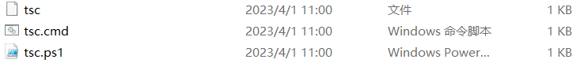

# 包管理工具

> 参考 [掘金 洋 z](https://juejin.cn/post/7176963409236197413)
>
> [掘金](https://juejin.cn/post/6844904030620090382)
>
> [掘金 从终端命令解析器说起谈谈 npm 包管理工具的运行原理](https://juejin.cn/post/7161063570594070559)

## npm run xxx

1. `package.json` 中有一个`bin`字段，用于指定当前包的可执行脚本
2. 在`npm i xxx` 时会在`node_modules/.bin/`创建好对应的可执行文件
3. `.bin`目录下的文件，会找到对应的可执行脚本(看一眼对应的文件就明白了)
4. 在`npm run xxx`时，`xxx`对应的命令，会在`node_modules/.bin/`

## npm link

**使用场景**

为开发的模块(待发布的 npm 包)创造一个全局链接，方便进行测试。

### 创建、使用、去除软链

link-module 需要软链的包，project-A 想要使用 link-module 的包

1. 在 link-module 中`npm link`，创建全局软链
2. 在 project-A 中`npm link link-module`
3. 使用完后`npm unlink link-module`,`npm unlink link-module -g `或在 link-module 中`npm unlink`

### 其他

- npm yarn pnpm 之间 link 不能混用，它们各自维护自己的全局 link(猜测)
- link 的骚操作[stackoverflow](https://stackoverflow.com/questions/72032028/can-pnpm-replace-npm-link-yarn-link)

## 全局命令

以 `typescript`为例

```bash
npm install typescript -g
```

指定命令后会在系统变量 PATH 中设置的 node 命令所在的目录里写入以下命令文件



typescript 包会装在 同级目录的 node_modules 下

## Node CLI 原理

在 js 文件开头加入

```js
#!/usr/bin/env node
```

这段代码的意思是指定 node 为脚本解析器

配置 `package.json` 文件：

```json
{
  "bin": {
    "cli-test": "./index.js"
  }
}
```

## dependencies 和 devDependencies

比如我们在项目中安装 Element Plus 组件时，Element Plus 组件库中的 dependencies 选项中的依赖就同时被下载。devDependencies 选项的依赖则不会被下载

并不是 dependencies 选项中的依赖才会被一起打包，而 devDependencies 选项中的依赖就一定不会被打包。事实上，dependencies 和 devDependencies 选项中的依赖是否被打包，只取决于项目中是否引入了改依赖
