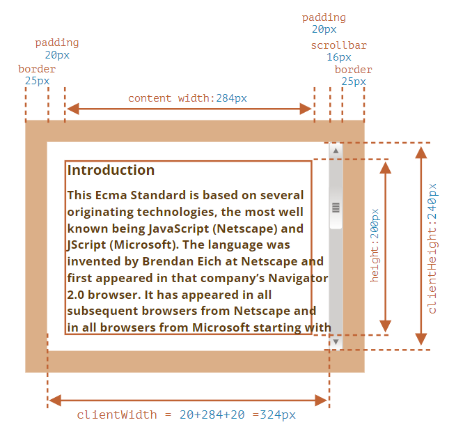

# CSS

## 垂直水平居中

> 参考[掘金](https://juejin.cn/post/7183124490459545655)

### 行内元素

```css
.parent {
  width: 400px;
  height: 400px;
  text-align: center;
  line-height: 400px;
}
```

### 定位

```css
.parent {
  width: 400px;
  height: 400px;
  position: relative;
}
.son {
  position: absolute;
  top: 50%;
  left: 50%;
  /* 未知宽高,transform */
  transform: translate(-50%, -50%);

  /* 已知宽高,margin: auto */
  width: 100px;
  height: 100px;
  top: 0;
  left: 0;
  right: 0;
  bottom: 0;
  margin: auto;

  /* 已知宽高 */
  width: 100px;
  height: 100px;
  top: 50%;
  left: 50%;
  margin-left: -50px;
  margin-top: -50px;
}
```

### flex

- 通用

```css
.parent {
  width: 500px;
  height: 500px;
  display: flex;
  align-items: center;
  justify-content: center;
}
```

- margin: auto

```css
.parent {
  width: 500px;
  height: 500px;
  display: flex;
}

.son {
  margin: auto;
}
```

### grid

```css
.parent {
  width: 500px;
  height: 500px;
  display: grid;
}

.son {
  align-self: center;
  justify-self: center;
}
```

## CSS 选择器权重

> 参考[vue3js.cn](https://vue3js.cn/interview/css/selector.html) [掘金](https://juejin.cn/post/7143203466893066270)

### 权重

- !important 无穷大
- 行内样式 style 1000
- id 选择器 0100
- 类选择器 伪类选择器 属性选择器 0010
- 标签选择器 伪元素选择器 0001
- 通配符选择器 +后 1 兄弟选择器 ~后所有兄弟选择器 0000

**比较规则**

- 从左往右依次进行比较 ，较大者优先级更高
- 如果相等，则继续往右移动一位进行比较
- 如果 4 位全部相等，则后面的会覆盖前面的

### @layer

@layer 声明了一个 级联层，同一层内的规则将级联在一起，不属于任何一级联层的样式将被集中到同一匿名层，并置于所有层的后部

@layer 可以让 CSS 声明的优先级下降一整个级联级别

**使用场景**

1. 覆盖第三方组件库样式
2. 有些组件的 CSS reset 污染了全局

**@layer 的解决方法**

1. 组件的 CSS 全部写入@layer 规则中，把自身的优先级降到底部
2. 对于第三方的 CSS 文件,可以在传统的 @import 语法后面再添加个 layer(layer-name)

```css
@import './lib.css' layer(lib);
```

## flex

- `flex-flow` 是`flex-direction` 和 `flex-wrap`属性的简写
- `justify-content`: `space-around`两端有间隙，`space-between`两端无间隙
- `align-items`作用于纵轴单行元素,`stretch`值拉伸 flex 项目以填充容器（默认）
- `align-content` 作用于纵轴多行元素,一行元素不起作用
- `order`规定 flex 项目的顺序,默认值是 0
- `flex-grow` 属性规定某个 flex 项目相对于其余 flex 项目将增长多少,默认值是 0
- `flex-shrink` 属性规定某个 flex 项目相对于其余 flex 项目将收缩多少,默认值是 0
- `flex-basis`规定 flex 项目的初始长度
- `flex：1`含义为, `flex-grow: 1` `flex-shrink: 1` `flex-basix: 0%`

flex 出现剩余空间或溢出空间后如何计算 flex 元素的宽度 [深入理解 flex-grow、flex-shrink、flex-basis](https://juejin.cn/post/6844904016439148551)

剩余或溢出空间：x，元素的 flex-grow 或 flex-shrink：a,b,c

- 元素的扩展空间：a/(a+b+c) \* x
- 元素的压缩空间：a \* w1 / (a \* w1 + b \* w2 + c \* w3) \* x

**justify-content 注意事项**

item4 和 item5 不会和 item1、item2 在垂直方向上对其

想要实现对其，可以在后面补伪元素

```html
<style>
  .box {
    display: flex;
    width: 400px;
    justify-content: space-around;
    flex-wrap: wrap;
  }
  .item {
    width: 110px;
    height: 100px;
    background-color: aqua;
  }
</style>
<div class="box">
  <div class="item">1</div>
  <div class="item">2</div>
  <div class="item">3</div>
  <div class="item">4</div>
  <div class="item">5</div>
</div>
```

## Less 和 Scss 的区别

[掘金 LESS 和 SCSS 的区别](https://juejin.cn/post/7091644504586846216)

Scss 在功能上面比 Less 更强大，Less 比较的清晰明了，容易上手

语法上的区别

- 声明和使用变量：Less 用@符号，Scss 用$符号表示
- Scss 支持条件语句，Less 不支持
- Mixins

```scss
@mixin theme($theme: DarkGray) {
  background: $theme;
  box-shadow: 0 0 1px rgba($theme, 0.25);
  color: #fff;
}

.info {
  @include theme;
}
```

```less
.bordered {
  border-top: dotted 1px black;
  border-bottom: solid 2px black;
}

#menu a {
  color: #111;
  .bordered();
}

.post a {
  color: red;
  .bordered();
}
```

## Sass 与 Scss

[掘金 Sass 和 Scss 的区别](https://juejin.cn/post/7033331497054519327)

- Scss 是 Sass 3 引入新的语法，是 Sassy CSS 的简写，其语法完全兼容 CSS3，并且继承了 Sass 的强大功能

- Sass 是以“.sass”后缀为扩展名，而 Scss 是以“.scss”后缀为扩展名。

- Sass 是以严格的缩进式语法规则来书写，SCSS 需要使用分号和花括号，与 CSS 语法类似

## 实体编码

> 参考 [山月](https://q.shanyue.tech/fe/html/480.html)

HTML 实体是一段以连字号（&）开头、以分号（;）结尾的字符串，用以显示不可见字符及保留字符

比如：

- 不可分的空格:＆nbsp;
- (小于符号):＆lt;
- (大于符号):＆gt;

## css 中哪些常见的布局方式

流式布局（Flow Layout）、浮动布局（Float Layout）、定位布局（Positioning Layout）、弹性盒子布局（Flexbox Layout）、网格布局（Grid Layout）

## margin 值为负数

## CSS 放在顶部，JS 放在底部

CSS 不会阻塞 DOM 的解析，可以和 DOM 一起解析，但会阻塞 DOM 的渲染

JS 放在底部：

1. 让浏览器更快地加载和解析 HTML 和 CSS，从而加速页面的加载速度
2. 避免 JavaScript 执行错误，因为 JS 可能会获取 DOM 信息

## width 值为百分数

相对于父元素 content 的宽度

## inline

- inline 元素设置 width、height 属性无效
- inline 元素的 margin 和 padding 属性，水平方向产生效果，垂直方向无效果
- vertical-align 用来指定行内元素（inline）或表格单元格（table-cell）元素的垂直对齐方式

## 定位

同时设置 left 和 right 时，left 生效，right 不生效，同样 top 和 bottom，top 生效

### top 参考点

参考 clientWidth 与 clientHeight 围起来的区域



图片来源 [现代 JavaScript 教程](https://zh.javascript.info/size-and-scroll)

## CSS 继承属性

> 参考[vue3js.cn](https://vue3js.cn/interview/css/selector.html)

**特殊**

- a 标签的字体颜色不能继承自父元素
- h1-h6 标签字体的大小也是不能继承自父元素
- 字体系列属性

```css
font:组合字体
font-family:规定元素的字体系列
font-weight:设置字体的粗细
font-size:设置字体的尺寸
font-style:定义字体的风格
font-variant:偏大或偏小的字体
```

- 文本系列属性

```css
text-indent：文本缩进
text-align：文本水平对刘
line-height：行高
word-spacing：增加或减少单词间的空白
letter-spacing：增加或减少字符间的空白
text-transform：控制文本大小写
direction：规定文本的书写方向
color：文本颜色
```

- 元素可见性

```css
visibility
```

- 表格布局属性

```css
caption-side：定位表格标题位置
border-collapse：合并表格边框
border-spacing：设置相邻单元格的边框间的距离
empty-cells：单元格的边框的出现与消失
table-layout：表格的宽度由什么决定
```

- 列表属性

```css
list-style-type：文字前面的小点点样式
list-style-position：小点点位置
list-style：以上的属性可通过这属性集合
```

- 引用

```css
quotes：设置嵌套引用的引号类型
```

- 光标属性

```css
cursor：箭头可以变成需要的形状
```

## CSS 实现三角形

> 参考自[洋 语雀](https://www.yuque.com/boyyang/buosw0/kdlw9p)和[掘金](https://juejin.cn/post/7075884138900750372)

1. border

`box-sizing` 为 `content-box`，宽高都设置成 0，则 div 只与 border 有关

`box-sizing` 为 `border-box`，设置每个边的宽度

实现一个上三角形示例

```css
.triangle {
  width: 0;
  height: 0;
  border-top: 50px solid skyblue;
  border-right: 50px solid transparent;
  border-left: 50px solid transparent;
}
```

<!-- <div style="width: 0; height: 0; border-top: 50px solid skyblue; border-right: 50px solid transparent; border-left: 50px solid transparent;"></div> -->

实现一个等边三角形

```css
.triangle {
  width: 0;
  height: 0;
  border-left: 69px solid transparent;
  border-right: 69px solid transparent;
  border-bottom: 120px solid skyblue;
}
```

<!-- <div style="width: 0; height: 0; border-left: 69px solid transparent; border-right: 69px solid transparent; border-bottom: 120px solid skyblue;"></div> -->

- linear-gradient

**缺点：** 需要手动调试渐变角度

```css
.triangle {
  width: 160px;
  height: 200px;
  outline: 2px solid skyblue;
  background-repeat: no-repeat;
  background-image: linear-gradient(
      32deg,
      orangered 50%,
      rgba(255, 255, 255, 0) 50%
    ), linear-gradient(148deg, orangered 50%, rgba(255, 255, 255, 0) 50%);
  background-size: 100% 50%;
  background-position:
    top left,
    bottom left;
}
```

- clip-path

**缺点：** 浏览器兼容不好

clip-path 就是使用它来绘制多边形（或圆形、椭圆形等）并将其定位在元素内。实际上，浏览器不会绘制 clip-path 之外的任何区域，因此我们看到的是 clip-path 的边界。

```css
.triangle {
  margin: 100px;
  width: 160px;
  height: 200px;
  background-color: skyblue;
  // top-left (0 0)、bottom-left (0% 100%)、right-center (100% 50%)
  clip-path: polygon(0 0, 0% 100%, 100% 50%);
}
```

## 常见 CSS 解决方案

- 手动控制模块化：比如在一个组件的最外层容器中定义一个类名，在组件内部的 css 选择器都加上该类名
- CSS Module：通过给每个 css 类名加上 hash 后缀的方式，让CSS类名局部化
- 原子化 CSS：预先定义一系列 css 工具类，通过组合这些工具类的方式，描述样式
- CSS in JS：将 CSS 样式直接嵌入 JavaScript 组件中的技术，动态修改更加灵活
