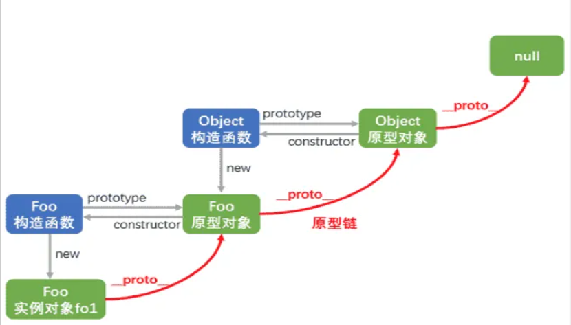

# JavaScript 进阶

> 参考[前端学习文档](https://kiraraty.github.io/fe-doc/#/interview/javascript%E8%BF%9B%E9%98%B6)

## let const var

|                    | var | let | const |
| ------------------ | :-: | :-: | :---: |
| 是否有块级作用域   |  ×  | ✔  |  ✔   |
| 是否存在变量提升   | ✔  |  ×  |   ×   |
| 是否添加全局属性   | ✔  |  ×  |   ×   |
| 能否重复声明变量   | ✔  |  ×  |   ×   |
| 是否存在暂时性死区 |  ×  | ✔  |  ✔   |
| 是否必须设置初始值 |  ×  |  ×  |  ✔   |
| 能否改变指针指向   | ✔  | ✔  |   ×   |

## 作用域和作用域链

### 作用域

作用域是在程序运行时代码中的某些特定部分中变量、函数和对象的可访问性

### 作用域分类

作用域又分为`全局作用域`和`局部作用域`。在 ES6 之前，局部作用域只包含了`函数作用域`，ES6 的到来为我们提供了 `块级作用域`（由一对花括号包裹），可以通过新增命令 let 和 const 来实现

### 作用域链

概念： 多个作用域对象连续引用形成的链式结构

函数的作用域是在函数定义的时候就被决定了，与函数在哪里被调用无关

## 原型和原型链

在 JavaScript 中是使用构造函数来新建一个对象的，每一个构造函数的内部都有一个 prototype 属性，它的属性值是一个对象，这个对象包含了可以由该构造函数的所有实例共享的属性和方法。

当访问一个对象的属性时，如果这个对象内部不存在这个属性，那么它就会去它的原型对象里找这个属性，这个原型对象又会有自己的原型，于是就这样一直找下去，也就是原型链的概念



> 图片来源与网络

```js
Person.prototype = {
  getName: function () {},
}
var p = new Person('hello')
p.constructor = Person
console.log(p.__proto__ === Person.prototype) // true
console.log(p.__proto__ === p.constructor.prototype) // true

p.__proto__ // Person.prototype
Person.prototype.__proto__ // Object.prototype
p.__proto__.__proto__ //Object.prototype
p.__proto__.constructor.prototype.__proto__ // Object.prototype
Person.prototype.constructor.prototype.__proto__ // Object.prototype
p1.__proto__.constructor // Person
Person.prototype.constructor // Person
```

## 空值合并运算符（??）

当左侧的操作数为 null 或者 undefined 时，返回其右侧操作数，否则返回左侧操作数。

```js
0 || 3 // 返回3
0 ?? 3 // 返回0
```

## Generator 函数

async 就是通过 Generator 函数实现 [async/await 原理](https://juejin.cn/post/7007031572238958629)

Generator 函数可以返回（yield）多个值，在调用函数时，不会运行其代码，返回一个被称为 “generator object” 的特殊对象，可以与 `iterable` 结合使用

```js
function* generateSequence() {
  yield 1
  yield 2
  return 3
}
const res = generateSequence()
console.log(res.next()) // { value: 1, done: false }
console.log(res.next()) // { value: 2, done: false }
console.log(res.next()) // { value: 3, done: true }
```

### “yield” 是一条双向路

它不仅可以向外返回结果，而且还可以将外部的值传递到 generator 内。

```js
function* gen() {
  const result = yield '2 + 2 = ?'
  console.log(result)
}
const res = gen()
console.log(res.next()) // { value: '2 + 2 = ?', done: false }
res.next(4) // 4
```

`generator.throw` yield 可以接受值，那么它也可以抛出一个错误

`generator.return(value)` 完成 generator 的执行并返回给定的 value

## 并发和并行的理解

并发：当有多个线程在操作时,如果系统只有一个 CPU,则它根本不可能真正同时进行一个以上的线程，它只能把 CPU 运行时间划分成若干个时间段,再将时间 段分配给各个线程执行，在一个时间段的线程代码运行时，其它线程处于挂起状。.这种方式我们称之为并发(Concurrent)。

并行：当系统有一个以上 CPU 时,则线程的操作有可能非并发。当一个 CPU 执行一个线程时，另一个 CPU 可以执行另一个线程，两个线程互不抢占 CPU 资源，可以同时进行，这种方式我们称之为并行(Parallel)。

## 执行上下文

当 JS 引擎解析到可执行代码片段（通常是函数调用阶段）的时候，就会先做一些执行前的准备工作，这个 “准备工作”，就叫做 "执行上下文

### 执行上下文的类型

- **全局执行上下文** ：这是默认或者说是最基础的执行上下文，一个程序中只会存在一个全局上下文，它在整个 javascript 脚本的生命周期内都会存在于执行堆栈的最底部不会被栈弹出销毁。全局上下文会生成一个全局对象（以浏览器环境为例，这个全局对象是 window），并且将 this 值绑定到这个全局对象上。
- **函数执行上下文** ：每当一个函数被调用时，都会创建一个新的函数执行上下文（不管这个函数是不是被重复调用的）
- **Eval 函数执行上下文** ：执行在 eval 函数内部的代码也会有它属于自己的执行上下文

## 闭包

[如何在 React 中逃离闭包陷阱](https://mp.weixin.qq.com/s?__biz=MjM5MTA1MjAxMQ==&mid=2651266017&idx=1&sn=da1a295ac76992c9e67038b6c6af9037&chksm=bd48c2658a3f4b7375f4aac91e352264d703c3cefa0989d71efa5f515edf57a2be7a745ae1cb#rd)

### 什么是闭包

闭包是一个函数在创建时允许该自身函数访问并操作该自身函数以外的变量时所创建的作用域。

1. 「函数」和「函数内部能访问到的变量」的总和，就是一个闭包
2. 函数和对其词法环境的引用捆绑在一起，这样的组合就是闭包

### 闭包的优缺点

- 好处
  - 避免污染全局变量
  - 形成不被污染的栈内存
- 坏处
  - 增大内存的使用量
  - 容易造成内存泄露

### 用途

- 延长变量的生命周期：闭包使得内部函数可以继续访问外部函数的变量，即使外部函数已经执行完毕。比如函数柯里化
- 封装私有变量和方法（比如 hooks）

### JS 内存分类

**堆内存** ：储存引用类型值，对象类型就是键值对，函数就是代码字符串
**栈内存** ：提供代码执行环境和储存基本类型值，函数执行完后函数的私有作用域就会被释放

## 内存泄露

程序在申请内存后，无法释放已申请的内存空间，一次或多次内存泄漏会导致可分配的内存越来越少，最终可能导致系统因缺少内存而无法正常运行。简而言之，就是程序失去了对已分配内存的控制，使得这部分内存无法被再次使用，即使程序不再需要这些内存资源。

常见内存泄漏：

- 无意间将大量数据绑定到全局变量上
- 闭包函数引用外部变量，并且变量包含大量数据 或 dom，可能会照成泄漏
- 未清理的事件监听、定时器等
- 引用的 DOM 已被卸载

解决措施：

- 不再使用的变量及时设置为 null，及时清理监听与定时器
- 避免使用全局变量
- 使用 WeakMap

## this

this 是执行上下文中的一个属性，它指向最后一次调用这个方法的对象。在实际开发中，this 的指向可以通过四种调用模式来判断。

- 函数调用模式，当一个函数不是一个对象的属性时，直接作为函数来调用时，非严格模式下 this 指向全局对象
- 方法调用模式
- 构造器调用模式，如果一个函数用 new 调用时，函数执行前会新创建一个对象，this 指向这个新创建的对象
- apply 、 call 和 bind 调用模式

## 箭头函数

1. 函数体内的 this 对象，继承的是外层代码块的 this。
2. 不可以当作构造函数，也就是说，不可以使用 new 命令，否则会抛出一个错误。
3. 不可以使用 arguments 对象，该对象在函数体内不存在。如果要用，可以用 rest 参数代替。
4. 不可以使用 yield 命令，因此箭头函数不能用作 Generator 函数。
5. 箭头函数没有自己的 this，所以不能用 call()、apply()、bind()这些方法去改变 this 的指向

## Proxy 和 Reflect

Proxy 与 Reflect 搭配使用是为了保证正确的 this 指向

### 多标签通信

[掘金](https://juejin.cn/post/7087933110678978573)

- localStorage，通过 `window.addEventListener("storage", () => {})` 监听 localStorage 的变化
- websocket
- SharedWorker，与 websocket 类似，可以监听 message 事件
- cookie + setInterval

## WeakMap

因为 WeakMap 的 key 是弱引用，所以在 GC 时不会记做对 key 的引用，结合 [Rust Weak](https://course.rs/advance/circle-self-ref/circle-reference.html#weak-%E4%B8%8E-rc-%E5%AF%B9%E6%AF%94) 进行理解

如果 Map 的 key 是 object，那么当 object 不再使用需要被 GC 时，由于 Map 引用了它，所以无法被 GC

WeakMap 相当于不拥有 key 的所有权，因此可以被正常 GC
