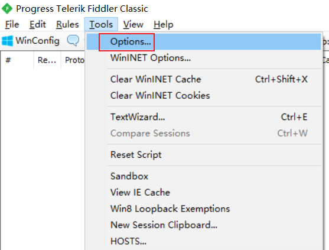
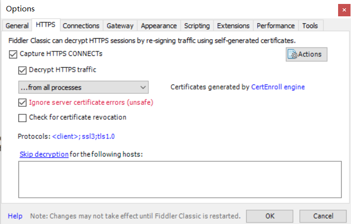
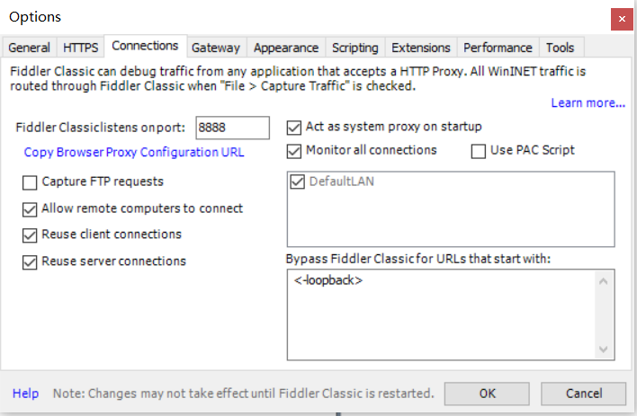
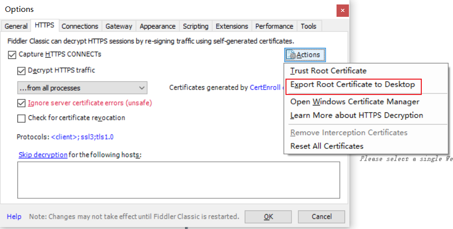

# Fiddler

下载 Fiddler Classic [官网](https://www.telerik.com/fiddler/fiddler-classic)

## 配置





## Android 系统证书



安装 [openssl](https://slproweb.com/products/Win32OpenSSL.html)

```shell
openssl x509 -inform DER -in .\FiddlerRoot.cer -out .\Fiddler.pem

openssl x509 -inform PEM -subject_hash_old -in .\Fiddler.pem
# 复制前面简短的哈希值
```

把 Fiddler.pem 重命名为 `<hash>.0`

把文件放到 `/system/etc/security/cacerts` 目录下
