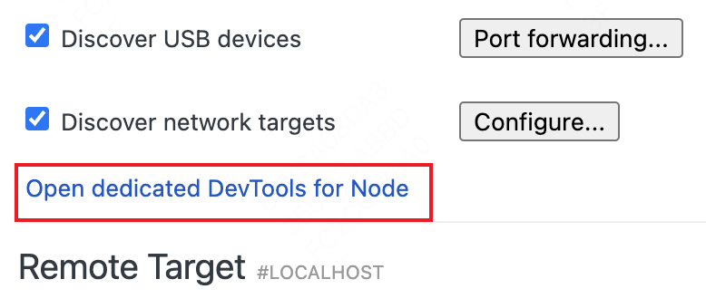
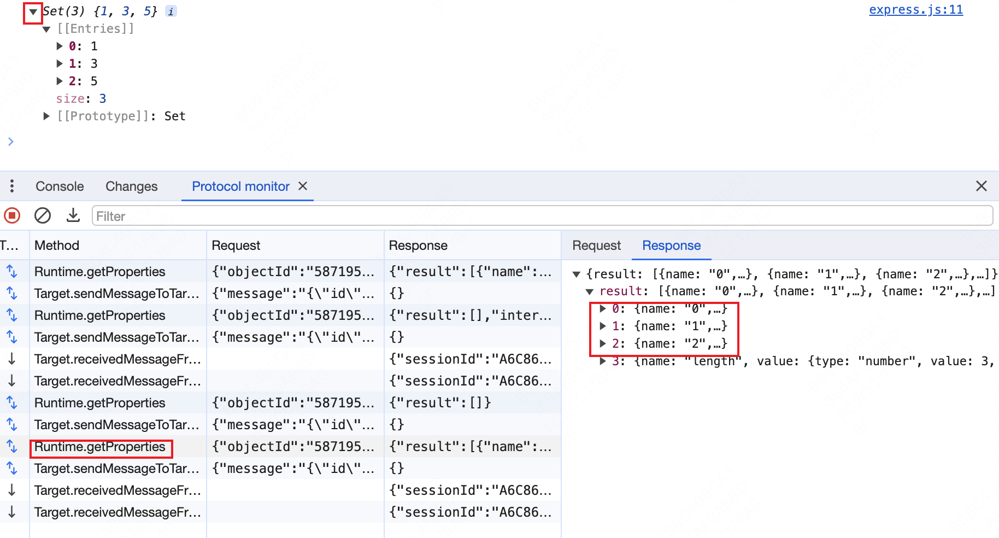

# Debug

> [一文搞懂前端各种调试方法的原理](https://mp.weixin.qq.com/s/QHE32rzlZHqp1yWMfxaC9A)

## 打开 protocol monitor 面板

protocol monitor 是一项实验性质

## Chrome Devtools

devtools 其实是一个页面，可以在 Chrome 打开 `devtools://devtools/bundled/inspector.html` 查看，[源码](https://source.chromium.org/chromium/chromium/src/+/main:out/Debug/gen/third_party/devtools-frontend/src/front_end/inspector.html;bpv=0;bpt=0)

将 node 的 log 信息输出到浏览器的控制台中 [调试指南](https://nodejs.org/en/guides/debugging-getting-started/)

Node 进程必须阻塞

```sh
node --inspect server.js
```

在 chrome 打开 `chrome://inspect/#devices`



启动 node inspect 的时候，chrome 会自动捕获

### 调试 Cli 程序

可以修改 node_modules/.bin 下对应的 cli 程序，例如修改 vite 的可执行文件：

```sh
#!/bin/sh
basedir=$(dirname "$(echo "$0" | sed -e 's,\\,/,g')")
exec node --inspect  "$basedir/../vite/bin/vite.js" "$@"
```

### 调试 Node 程序

```sh
node inspect demo.js
# 或
node-inspect demo.js
```

在 chrome 打开 `chrome://inspect/#devices`


启动 node inspect 的时候，chrome 会自动捕获

在 source 面板下，可单步运行 Node 程序，也可以在 Console 中看到打印

## CDP

[Chrome DevTools Protocol](https://chromedevtools.github.io/devtools-protocol/)



当点击小三角对 `set` 进行展开时，devtools 通过请求获取 `set` 的信息，然后进行展示
